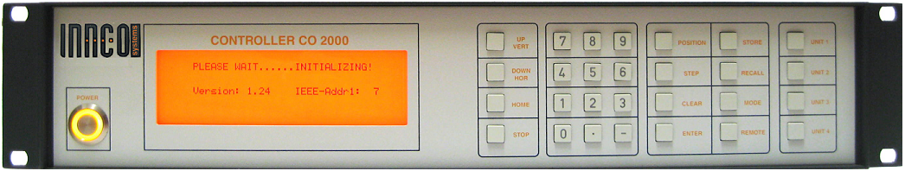

#### Description
Python module for Innco CO 2000 controller, only for turn table device.  
  

#### Usage
First run `test-visa.py` and get correct instrument interface, then edit `table.py` accordingly.  
Check `test-visa.py` and `test-table.py`.  

#### Resources
Requires PyVISA, tested with version 1.9.1.  
Device manual can be found [here](https://forums.ni.com/ni/attachments/ni/170/540327/1/turntable_Bedienungsanleitung.pdf_%5BbINI3b%5D%5B1%5D.pdf).  
Origin repo at github.com/eardali

#### License
Distributed under the terms of the MIT license.
